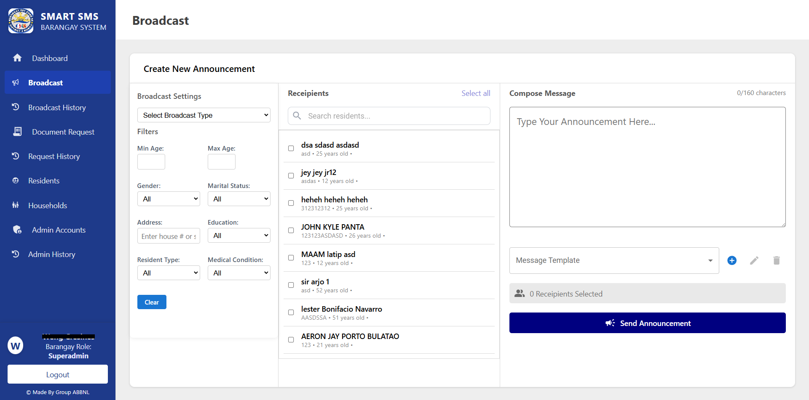
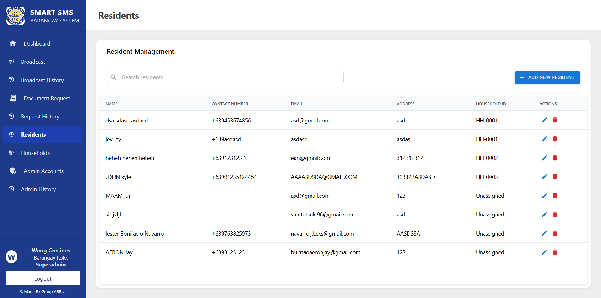
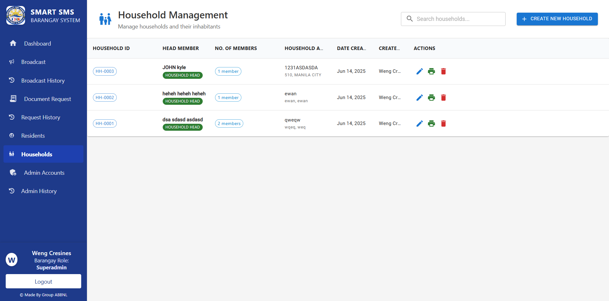
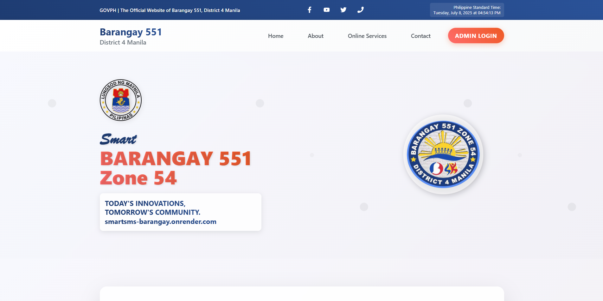

# SmartSMS Barangay Management System

A modern, full-stack web application for efficient barangay management, resident records, document requests, and mass communication via SMS and email. Designed for local government units to streamline operations and improve community engagement.

---

## Features

- **Bulk SMS Announcements**: Instantly broadcast messages to residents using [android-sms-gateway](https://sms-gate.app/). Admins can send announcements directly from the dashboard, leveraging an Android device as the SMS gateway. See [android-sms-gateway documentation](https://sms-gate.app/) for setup details.
- **Email Notifications**: Send official documents and notifications via email using a secure SMTP client. Only admins can access this feature.
- **Resident & Household Management**: Register, update, and manage residents and households with audit trails.
- **Document Requests**: Residents can request certificates (e.g., Indigency, Residency) online. Admins approve, reject, and track requests.
- **Role-Based Access**: Superadmin (pre-created) manages admin accounts. Admins handle daily operations. To use the app, copy `.env` and add your own variables.
- **Audit Logs**: Track all admin actions for transparency.

---

## Live Demo

🌐 **Try it now:** [smartsms-barangay.onrender.com](https://smartsms-barangay.onrender.com)

---

## Screenshots

### Dashboard Broadcast

### Residents

### Households

### Homepage

### Barangay Form Request

---

## Getting Started

1. **Clone the repository**
2. **Install dependencies** for both `backend` and `frontend/smartsmsFE`
3. **Start the backend**: `npm start` in `/backend`
4. **Start the frontend**: `npm run dev` in `/frontend/smartsmsFE`
5. **Service backend API**: `make sure to put the backend host in baseUrl variable` in `/frontend/smartsmsFE/services/service.js Ex. const baseUrl = 'http://localhost:3001/api and add .env in backend (contact me for more info)`

> **Note:** Only admins can access the dashboard. Superadmin is pre-created; new admins are created by the superadmin.

---

## Bulk SMS via android-sms-gateway

- Uses [android-sms-gateway](https://sms-gate.app/) to send SMS from an Android device.
- Set up the gateway app on your phone and configure the backend with your device's API key.
- See [official documentation](https://sms-gate.app/) for integration steps.

## Email Functionality

- Uses SMTP client for sending emails (e.g., document requests, notifications).
- Configure SMTP credentials in your `.env` file.

---

## License

This project is licensed under the MIT License. See [LICENSE](./LICENSE) for details.

---

## Credits

Developed for local government digital transformation. Contributions welcome!
